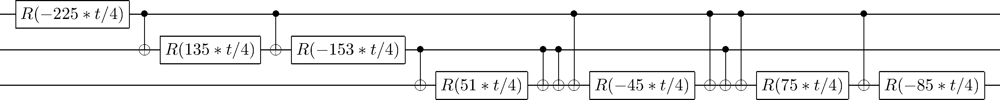

# qcedo
Generates exact quantum circuits for exponentiating diagonal operators. Supports symbolics.

For example, here is a circuit for  with
<p align="center"> 

</p>



Supply a function that maps *i → H<sub>i,i</sub>* and the program will output QASM code for the circuit implementing *e<sup>i H</sup>* up to a global phase. The circuit will always be composed of alternating phase shift and CNOT gates.

Note that this method will use *2<sup>n</sup>-3* fundamental gates in the worst case, so will not provide an efficient quantum circuit in general. Reference [2] details how to approximate the exponentiation to arbitrary precision and produce an efficient quantum circuit, but this project was designed to *exactly* replicate the desired operator.

### Usage

The `gates(n, fn)` function takes as input the number of qubits *n* and a function *f(x)* that takes *x = 0 ... 2<sup>n</sup>-1* to the corresponding diagonal element of the desired Hamiltonian. The output for the Hamiltonian above is 
```
('R', -225*t/4, 0)
('CNOT', 0, 1)
('R', 135*t/4, 1)
('CNOT', 0, 1)
('R', -153*t/4, 1)
('CNOT', 1, 2)
('R', 51*t/4, 2)
('CNOT', 0, 2)
('R', -45*t/4, 2)
('CNOT', 1, 2)
('R', 75*t/4, 2)
('CNOT', 0, 2)
('R', -85*t/4, 2)
```
where `('R', θ, q)` represents a phase shift of *θ* on qubit *q*, and `('CNOT', qc, qt)` is a CNOT with control *qc* and target *qt*. Further, the function `print_qasm(n, gates)` takes in the number of qubits and the list of gates and converts it to QASM code. It can then be visualised with a program such as [qasm2circ](https://www.media.mit.edu/quanta/qasm2circ/).

<br>

<sub>[1] J. L. Shanks, 1969, IEEE Transactions on Computers 18-5, 457</sub>

<sub>[2] Jonathan Welch et al, 2014, New J. Phys. 16, 033040</sub>

