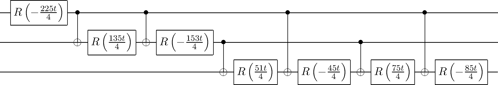

# qcedo
Generates exact quantum circuits for exponentiating diagonal operators. Supports symbolics.

For example, here is a circuit for  with

 

Supply a function that maps *i → Hi,i* and the program will output QASM code for the circuit implementing *ei H*.

Note this is a work in progress -- the CNOT gates still need to be optimised. Once complete, there will be at most one CNOT between any two given phase gates.

 

[1] J. L. Shanks, 1969, IEEE Transactions on Computers 18-5 457

[2] Jonathan Welch et al, 2014, New J. Phys. 16 033040
